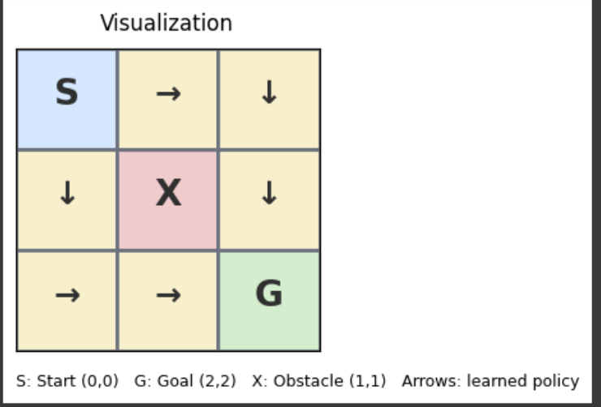

# Q-Learning Gridworld with Policy Visualization

This project implements a simple **Q-learning** agent in a small 3×3 gridworld environment with a **start position (S)**, a **goal (G)**, and an **obstacle (X)**.  
The agent learns an optimal policy through interaction with the environment and the learned policy is visualized as arrows showing the best move from each state.

---

## 📜 Table of Contents
1. [Overview](#overview)
2. [Environment Setup](#environment-setup)
3. [Q-Learning Algorithm](#q-learning-algorithm)
4. [Defined Methods](#defined-methods)
5. [Visualization](#visualization)
6. [Running the Code](#running-the-code)
7. [Possible Improvements](#possible-improvements)
8. [License](#license)

---

## Overview
The goal of this project is to demonstrate:
- How Q-learning works in a discrete state-action space.
- How an agent balances exploration vs. exploitation.
- How learned policies can be visualized in an intuitive grid format.

**Environment specifics:**
- **Grid size:** 3×3
- **Start:** `(0, 0)` (top-left cell)
- **Goal:** `(2, 2)` (bottom-right cell)
- **Obstacle:** `(1, 1)` (center cell, not passable)
- **Actions:** Up, Down, Left, Right

---

## Environment Setup

The environment is represented as a matrix of coordinates:

| (0,0) | (0,1) | (0,2) |
|-------|-------|-------|
| (1,0) |  X    | (1,2) |
| (2,0) | (2,1) |  G    |

Where:
- `S` = Start position
- `G` = Goal position
- `X` = Obstacle

The agent can move in **four directions**:
```python
ACTIONS = [
    (1, 0),   # down
    (0, 1),   # right
    (-1, 0),  # up
    (0, -1)   # left
]
```

---

## Q-Learning Algorithm

Q-learning is an **off-policy reinforcement learning algorithm** that learns the value of taking a given action in a given state.

**Update Rule (Bellman Equation):**
```
Q(s, a) ← Q(s, a) + α [ r + γ * max_a' Q(s', a') - Q(s, a) ]
```

Where:
- `α` (**ALPHA**) = Learning rate (how quickly we incorporate new information).
- `γ` (**GAMMA**) = Discount factor (importance of future rewards).
- `r` = Immediate reward received after taking action `a` in state `s`.
- `s'` = Next state after taking action `a`.

**Exploration vs Exploitation:**
We use an `ε`-greedy strategy:
- With probability **ε** (EPSILON), choose a random action (exploration).
- Otherwise, choose the action with the highest Q-value (exploitation).

---

## Defined Methods

1. **`is_valid(state: Tuple[int, int]) -> bool`**  
   Checks if a state is within grid bounds and not the obstacle.

2. **`get_next_state(state: Tuple[int, int], action: Tuple[int, int]) -> Tuple[int, int]`**  
   Returns the new state after applying the given action; if invalid, returns the original state.

3. **`get_reward(state, next_state) -> int`**  
   Assigns rewards:
   - `+100` for reaching the goal.
   - `-10` for invalid moves (colliding with wall/obstacle).
   - `-1` for a regular step.

4. **`choose_action(state, q_table)`**  
   Selects an action using the ε-greedy strategy.

5. **`update_q_table(q_table, state, action, reward, next_state)`**  
   Updates Q-values using the Bellman equation.

6. **`train() -> np.ndarray`**  
   Runs Q-learning for a specified number of episodes and returns the trained Q-table.

7. **`visualize_policy_grid(q_table, start, goal, obstacle)`**  
   Draws a colored grid visualization of the learned policy with:
   - `S` for start (blue)
   - `G` for goal (green)
   - `X` for obstacle (red)
   - Arrows (`↑, ↓, →, ←`) for the learned best actions.

---

## Visualization

The learned policy is visualized as:

```
S → ↓
↓ X ↓
→ → G
```

Legend:
- **S** – Start position `(0,0)`
- **G** – Goal position `(2,2)`
- **X** – Obstacle `(1,1)`
- **Arrows** – Optimal moves from each state based on learned Q-values.

---

## Running the Code

### Requirements
```bash
pip install numpy matplotlib
```

### Execution
Run the Python script or Colab cell:
```python
q_table = train()
visualize_policy_grid(q_table, START, GOAL, OBSTACLE)
```

---

## Possible Improvements
- Implement **epsilon decay** for better convergence.
- Allow larger grids and multiple obstacles.
- Add **stochastic transitions** for non-deterministic environments.
- Log and visualize Q-value evolution over time.
- Implement **SARSA** or **Deep Q-Network (DQN)** for comparison.

---





__


__


